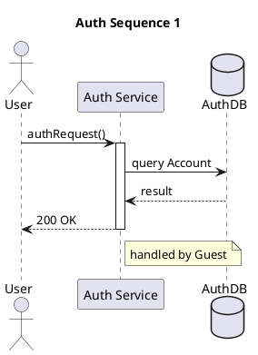

# 001 — Sequence: Auth

```plantuml
@startuml
title Auth Sequence 1
actor User as A
participant "Auth Service" as S
database "AuthDB" as DB
A -> S : authRequest()
activate S
S -> DB : query Account
DB --> S : result
S --> A : 200 OK
deactivate S
note right of S : handled by Guest
@enduml
```
