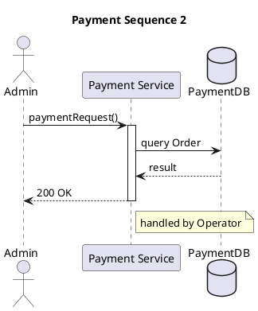

# 002 — Sequence: Payment

```plantuml
@startuml
title Payment Sequence 2
actor Admin as A
participant "Payment Service" as S
database "PaymentDB" as DB
A -> S : paymentRequest()
activate S
S -> DB : query Order
DB --> S : result
S --> A : 200 OK
deactivate S
note right of S : handled by Operator
@enduml
```
