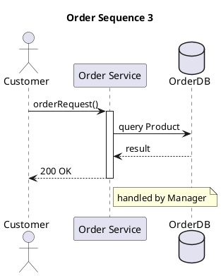

# 003 — Sequence: Order

```plantuml
@startuml
title Order Sequence 3
actor Customer as A
participant "Order Service" as S
database "OrderDB" as DB
A -> S : orderRequest()
activate S
S -> DB : query Product
DB --> S : result
S --> A : 200 OK
deactivate S
note right of S : handled by Manager
@enduml
```
