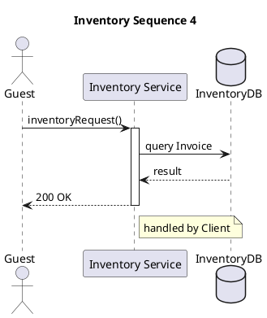

# 004 — Sequence: Inventory

```plantuml
@startuml
title Inventory Sequence 4
actor Guest as A
participant "Inventory Service" as S
database "InventoryDB" as DB
A -> S : inventoryRequest()
activate S
S -> DB : query Invoice
DB --> S : result
S --> A : 200 OK
deactivate S
note right of S : handled by Client
@enduml
```
