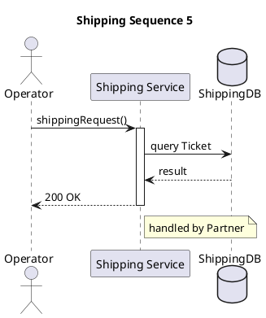

# 005 — Sequence: Shipping

```plantuml
@startuml
title Shipping Sequence 5
actor Operator as A
participant "Shipping Service" as S
database "ShippingDB" as DB
A -> S : shippingRequest()
activate S
S -> DB : query Ticket
DB --> S : result
S --> A : 200 OK
deactivate S
note right of S : handled by Partner
@enduml
```
