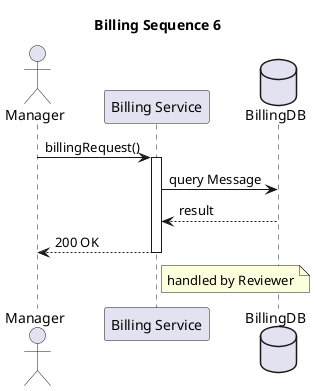

# 006 — Sequence: Billing

```plantuml
@startuml
title Billing Sequence 6
actor Manager as A
participant "Billing Service" as S
database "BillingDB" as DB
A -> S : billingRequest()
activate S
S -> DB : query Message
DB --> S : result
S --> A : 200 OK
deactivate S
note right of S : handled by Reviewer
@enduml
```
