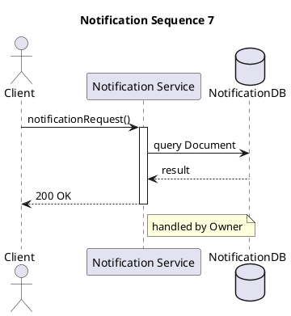

# 007 — Sequence: Notification

```plantuml
@startuml
title Notification Sequence 7
actor Client as A
participant "Notification Service" as S
database "NotificationDB" as DB
A -> S : notificationRequest()
activate S
S -> DB : query Document
DB --> S : result
S --> A : 200 OK
deactivate S
note right of S : handled by Owner
@enduml
```
