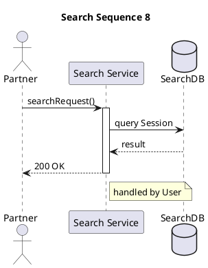

# 008 — Sequence: Search

```plantuml
@startuml
title Search Sequence 8
actor Partner as A
participant "Search Service" as S
database "SearchDB" as DB
A -> S : searchRequest()
activate S
S -> DB : query Session
DB --> S : result
S --> A : 200 OK
deactivate S
note right of S : handled by User
@enduml
```
