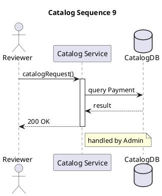

# 009 — Sequence: Catalog

```plantuml
@startuml
title Catalog Sequence 9
actor Reviewer as A
participant "Catalog Service" as S
database "CatalogDB" as DB
A -> S : catalogRequest()
activate S
S -> DB : query Payment
DB --> S : result
S --> A : 200 OK
deactivate S
note right of S : handled by Admin
@enduml
```
