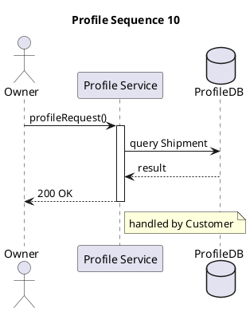

# 010 — Sequence: Profile

```plantuml
@startuml
title Profile Sequence 10
actor Owner as A
participant "Profile Service" as S
database "ProfileDB" as DB
A -> S : profileRequest()
activate S
S -> DB : query Shipment
DB --> S : result
S --> A : 200 OK
deactivate S
note right of S : handled by Customer
@enduml
```
