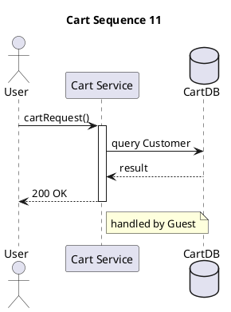

# 011 — Sequence: Cart

```plantuml
@startuml
title Cart Sequence 11
actor User as A
participant "Cart Service" as S
database "CartDB" as DB
A -> S : cartRequest()
activate S
S -> DB : query Customer
DB --> S : result
S --> A : 200 OK
deactivate S
note right of S : handled by Guest
@enduml
```
