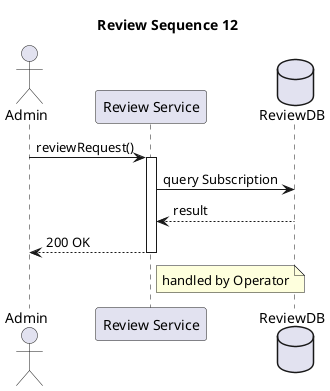

# 012 — Sequence: Review

```plantuml
@startuml
title Review Sequence 12
actor Admin as A
participant "Review Service" as S
database "ReviewDB" as DB
A -> S : reviewRequest()
activate S
S -> DB : query Subscription
DB --> S : result
S --> A : 200 OK
deactivate S
note right of S : handled by Operator
@enduml
```
