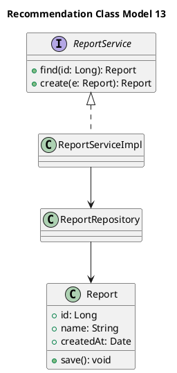

# 013 — Class: Recommendation

```plantuml
@startuml
title Recommendation Class Model 13
class Report {
  +id: Long
  +name: String
  +createdAt: Date
  +save(): void
}
interface ReportService {
  +find(id: Long): Report
  +create(e: Report): Report
}
class ReportServiceImpl
class ReportRepository
ReportService <|.. ReportServiceImpl
ReportServiceImpl --> ReportRepository
ReportRepository --> "Report"
@enduml
```
