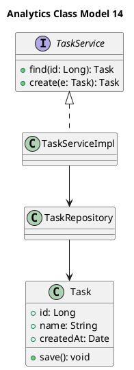

# 014 — Class: Analytics

```plantuml
@startuml
title Analytics Class Model 14
class Task {
  +id: Long
  +name: String
  +createdAt: Date
  +save(): void
}
interface TaskService {
  +find(id: Long): Task
  +create(e: Task): Task
}
class TaskServiceImpl
class TaskRepository
TaskService <|.. TaskServiceImpl
TaskServiceImpl --> TaskRepository
TaskRepository --> "Task"
@enduml
```
