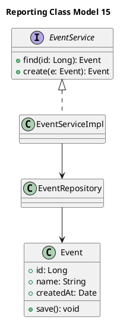

# 015 — Class: Reporting

```plantuml
@startuml
title Reporting Class Model 15
class Event {
  +id: Long
  +name: String
  +createdAt: Date
  +save(): void
}
interface EventService {
  +find(id: Long): Event
  +create(e: Event): Event
}
class EventServiceImpl
class EventRepository
EventService <|.. EventServiceImpl
EventServiceImpl --> EventRepository
EventRepository --> "Event"
@enduml
```
