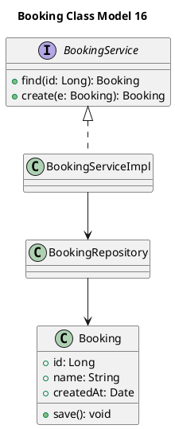

# 016 — Class: Booking

```plantuml
@startuml
title Booking Class Model 16
class Booking {
  +id: Long
  +name: String
  +createdAt: Date
  +save(): void
}
interface BookingService {
  +find(id: Long): Booking
  +create(e: Booking): Booking
}
class BookingServiceImpl
class BookingRepository
BookingService <|.. BookingServiceImpl
BookingServiceImpl --> BookingRepository
BookingRepository --> "Booking"
@enduml
```
