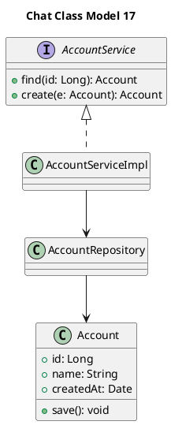

# 017 — Class: Chat

```plantuml
@startuml
title Chat Class Model 17
class Account {
  +id: Long
  +name: String
  +createdAt: Date
  +save(): void
}
interface AccountService {
  +find(id: Long): Account
  +create(e: Account): Account
}
class AccountServiceImpl
class AccountRepository
AccountService <|.. AccountServiceImpl
AccountServiceImpl --> AccountRepository
AccountRepository --> "Account"
@enduml
```
