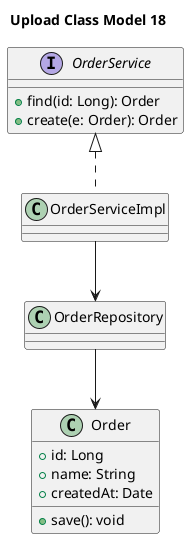

# 018 — Class: Upload

```plantuml
@startuml
title Upload Class Model 18
class Order {
  +id: Long
  +name: String
  +createdAt: Date
  +save(): void
}
interface OrderService {
  +find(id: Long): Order
  +create(e: Order): Order
}
class OrderServiceImpl
class OrderRepository
OrderService <|.. OrderServiceImpl
OrderServiceImpl --> OrderRepository
OrderRepository --> "Order"
@enduml
```
