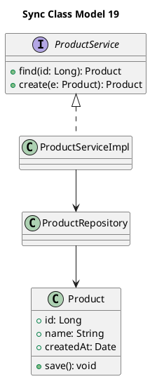

# 019 — Class: Sync

```plantuml
@startuml
title Sync Class Model 19
class Product {
  +id: Long
  +name: String
  +createdAt: Date
  +save(): void
}
interface ProductService {
  +find(id: Long): Product
  +create(e: Product): Product
}
class ProductServiceImpl
class ProductRepository
ProductService <|.. ProductServiceImpl
ProductServiceImpl --> ProductRepository
ProductRepository --> "Product"
@enduml
```
