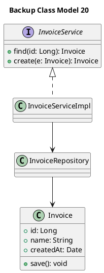

# 020 — Class: Backup

```plantuml
@startuml
title Backup Class Model 20
class Invoice {
  +id: Long
  +name: String
  +createdAt: Date
  +save(): void
}
interface InvoiceService {
  +find(id: Long): Invoice
  +create(e: Invoice): Invoice
}
class InvoiceServiceImpl
class InvoiceRepository
InvoiceService <|.. InvoiceServiceImpl
InvoiceServiceImpl --> InvoiceRepository
InvoiceRepository --> "Invoice"
@enduml
```
