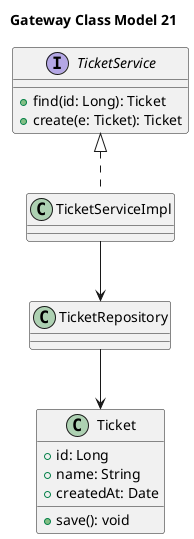

# 021 — Class: Gateway

```plantuml
@startuml
title Gateway Class Model 21
class Ticket {
  +id: Long
  +name: String
  +createdAt: Date
  +save(): void
}
interface TicketService {
  +find(id: Long): Ticket
  +create(e: Ticket): Ticket
}
class TicketServiceImpl
class TicketRepository
TicketService <|.. TicketServiceImpl
TicketServiceImpl --> TicketRepository
TicketRepository --> "Ticket"
@enduml
```
