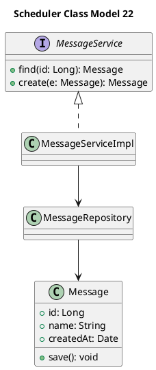

# 022 — Class: Scheduler

```plantuml
@startuml
title Scheduler Class Model 22
class Message {
  +id: Long
  +name: String
  +createdAt: Date
  +save(): void
}
interface MessageService {
  +find(id: Long): Message
  +create(e: Message): Message
}
class MessageServiceImpl
class MessageRepository
MessageService <|.. MessageServiceImpl
MessageServiceImpl --> MessageRepository
MessageRepository --> "Message"
@enduml
```
