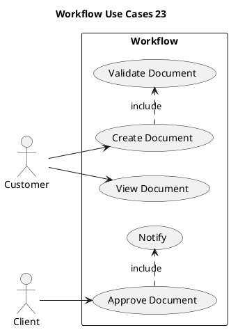

# 023 — Usecase: Workflow

```plantuml
@startuml
left to right direction
title Workflow Use Cases 23
actor Customer
actor Client
rectangle Workflow {
  Customer --> (Create Document)
  Customer --> (View Document)
  Client --> (Approve Document)
  (Create Document) .> (Validate Document) : include
  (Approve Document) .> (Notify) : include
}
@enduml
```
