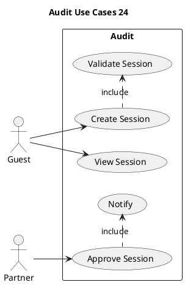

# 024 — Usecase: Audit

```plantuml
@startuml
left to right direction
title Audit Use Cases 24
actor Guest
actor Partner
rectangle Audit {
  Guest --> (Create Session)
  Guest --> (View Session)
  Partner --> (Approve Session)
  (Create Session) .> (Validate Session) : include
  (Approve Session) .> (Notify) : include
}
@enduml
```
