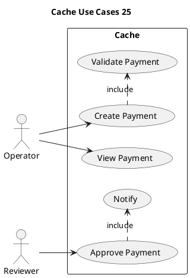

# 025 — Usecase: Cache

```plantuml
@startuml
left to right direction
title Cache Use Cases 25
actor Operator
actor Reviewer
rectangle Cache {
  Operator --> (Create Payment)
  Operator --> (View Payment)
  Reviewer --> (Approve Payment)
  (Create Payment) .> (Validate Payment) : include
  (Approve Payment) .> (Notify) : include
}
@enduml
```
