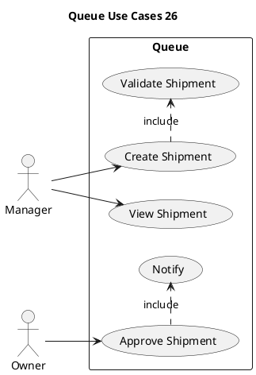

# 026 — Usecase: Queue

```plantuml
@startuml
left to right direction
title Queue Use Cases 26
actor Manager
actor Owner
rectangle Queue {
  Manager --> (Create Shipment)
  Manager --> (View Shipment)
  Owner --> (Approve Shipment)
  (Create Shipment) .> (Validate Shipment) : include
  (Approve Shipment) .> (Notify) : include
}
@enduml
```
