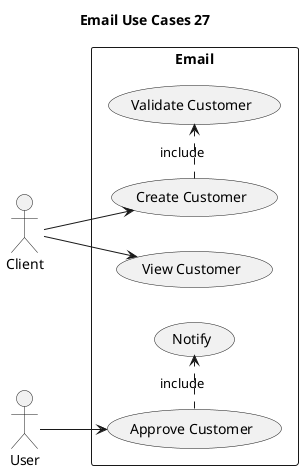

# 027 — Usecase: Email

```plantuml
@startuml
left to right direction
title Email Use Cases 27
actor Client
actor User
rectangle Email {
  Client --> (Create Customer)
  Client --> (View Customer)
  User --> (Approve Customer)
  (Create Customer) .> (Validate Customer) : include
  (Approve Customer) .> (Notify) : include
}
@enduml
```
