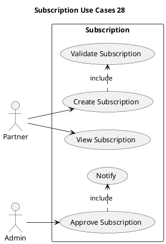

# 028 — Usecase: Subscription

```plantuml
@startuml
left to right direction
title Subscription Use Cases 28
actor Partner
actor Admin
rectangle Subscription {
  Partner --> (Create Subscription)
  Partner --> (View Subscription)
  Admin --> (Approve Subscription)
  (Create Subscription) .> (Validate Subscription) : include
  (Approve Subscription) .> (Notify) : include
}
@enduml
```
