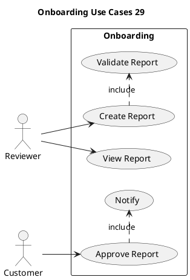

# 029 — Usecase: Onboarding

```plantuml
@startuml
left to right direction
title Onboarding Use Cases 29
actor Reviewer
actor Customer
rectangle Onboarding {
  Reviewer --> (Create Report)
  Reviewer --> (View Report)
  Customer --> (Approve Report)
  (Create Report) .> (Validate Report) : include
  (Approve Report) .> (Notify) : include
}
@enduml
```
