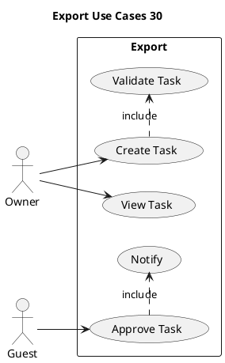

# 030 — Usecase: Export

```plantuml
@startuml
left to right direction
title Export Use Cases 30
actor Owner
actor Guest
rectangle Export {
  Owner --> (Create Task)
  Owner --> (View Task)
  Guest --> (Approve Task)
  (Create Task) .> (Validate Task) : include
  (Approve Task) .> (Notify) : include
}
@enduml
```
