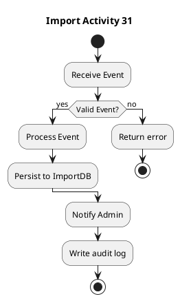

# 031 — Activity: Import

```plantuml
@startuml
title Import Activity 31
start
:Receive Event;
if (Valid Event?) then (yes)
  :Process Event;
  :Persist to ImportDB;
else (no)
  :Return error;
  stop
endif
:Notify Admin;
:Write audit log;
stop
@enduml
```
