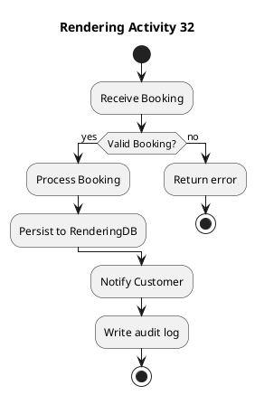

# 032 — Activity: Rendering

```plantuml
@startuml
title Rendering Activity 32
start
:Receive Booking;
if (Valid Booking?) then (yes)
  :Process Booking;
  :Persist to RenderingDB;
else (no)
  :Return error;
  stop
endif
:Notify Customer;
:Write audit log;
stop
@enduml
```
