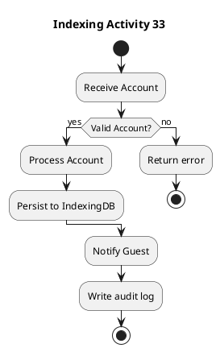

# 033 — Activity: Indexing

```plantuml
@startuml
title Indexing Activity 33
start
:Receive Account;
if (Valid Account?) then (yes)
  :Process Account;
  :Persist to IndexingDB;
else (no)
  :Return error;
  stop
endif
:Notify Guest;
:Write audit log;
stop
@enduml
```
