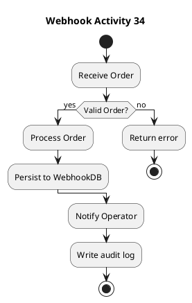

# 034 — Activity: Webhook

```plantuml
@startuml
title Webhook Activity 34
start
:Receive Order;
if (Valid Order?) then (yes)
  :Process Order;
  :Persist to WebhookDB;
else (no)
  :Return error;
  stop
endif
:Notify Operator;
:Write audit log;
stop
@enduml
```
