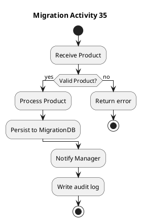

# 035 — Activity: Migration

```plantuml
@startuml
title Migration Activity 35
start
:Receive Product;
if (Valid Product?) then (yes)
  :Process Product;
  :Persist to MigrationDB;
else (no)
  :Return error;
  stop
endif
:Notify Manager;
:Write audit log;
stop
@enduml
```
