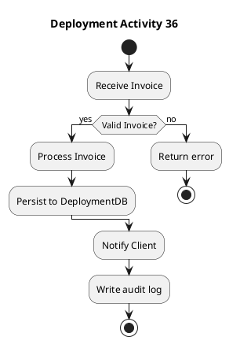

# 036 — Activity: Deployment

```plantuml
@startuml
title Deployment Activity 36
start
:Receive Invoice;
if (Valid Invoice?) then (yes)
  :Process Invoice;
  :Persist to DeploymentDB;
else (no)
  :Return error;
  stop
endif
:Notify Client;
:Write audit log;
stop
@enduml
```
