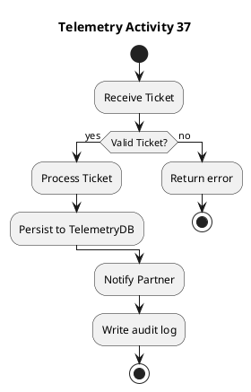

# 037 — Activity: Telemetry

```plantuml
@startuml
title Telemetry Activity 37
start
:Receive Ticket;
if (Valid Ticket?) then (yes)
  :Process Ticket;
  :Persist to TelemetryDB;
else (no)
  :Return error;
  stop
endif
:Notify Partner;
:Write audit log;
stop
@enduml
```
