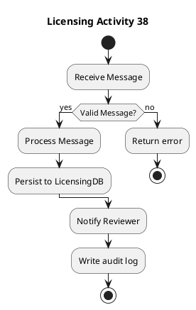

# 038 — Activity: Licensing

```plantuml
@startuml
title Licensing Activity 38
start
:Receive Message;
if (Valid Message?) then (yes)
  :Process Message;
  :Persist to LicensingDB;
else (no)
  :Return error;
  stop
endif
:Notify Reviewer;
:Write audit log;
stop
@enduml
```
