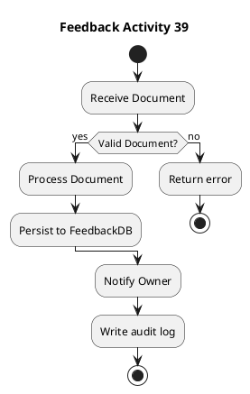

# 039 — Activity: Feedback

```plantuml
@startuml
title Feedback Activity 39
start
:Receive Document;
if (Valid Document?) then (yes)
  :Process Document;
  :Persist to FeedbackDB;
else (no)
  :Return error;
  stop
endif
:Notify Owner;
:Write audit log;
stop
@enduml
```
