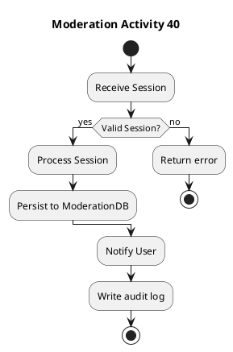

# 040 — Activity: Moderation

```plantuml
@startuml
title Moderation Activity 40
start
:Receive Session;
if (Valid Session?) then (yes)
  :Process Session;
  :Persist to ModerationDB;
else (no)
  :Return error;
  stop
endif
:Notify User;
:Write audit log;
stop
@enduml
```
