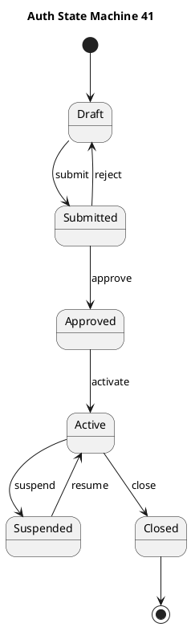

# 041 — State: Auth

```plantuml
@startuml
title Auth State Machine 41
[*] --> Draft
Draft --> Submitted : submit
Submitted --> Approved : approve
Submitted --> Draft : reject
Approved --> Active : activate
Active --> Suspended : suspend
Suspended --> Active : resume
Active --> Closed : close
Closed --> [*]
@enduml
```
