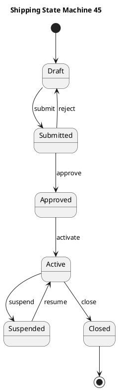

# 045 — State: Shipping

```plantuml
@startuml
title Shipping State Machine 45
[*] --> Draft
Draft --> Submitted : submit
Submitted --> Approved : approve
Submitted --> Draft : reject
Approved --> Active : activate
Active --> Suspended : suspend
Suspended --> Active : resume
Active --> Closed : close
Closed --> [*]
@enduml
```
