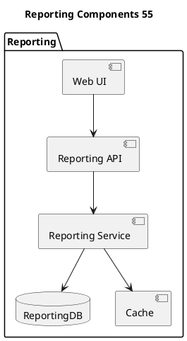

# 055 — Component: Reporting

```plantuml
@startuml
title Reporting Components 55
package "Reporting" {
  [Web UI] as UI
  [Reporting API] as API
  [Reporting Service] as SVC
  database "ReportingDB" as DB
  [Cache] as C
}
UI --> API
API --> SVC
SVC --> DB
SVC --> C
@enduml
```
