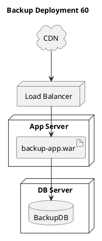

# 060 — Deployment: Backup

```plantuml
@startuml
title Backup Deployment 60
node "Load Balancer" as LB
node "App Server" {
  artifact "backup-app.war" as APP
}
node "DB Server" {
  database "BackupDB" as DB
}
cloud "CDN" as CDN
LB --> APP
APP --> DB
CDN --> LB
@enduml
```
