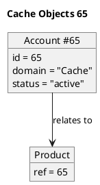

# 065 — Object: Cache

```plantuml
@startuml
title Cache Objects 65
object "Account #65" as O1 {
  id = 65
  domain = "Cache"
  status = "active"
}
object "Product" as O2 {
  ref = 65
}
O1 --> O2 : relates to
@enduml
```
