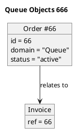

# 0666666 — Object: Queues

```plantuml
@startuml
title Queue Objects 666
object "Order #66" as O1 {
  id = 66
  domain = "Queue"
  status = "active"
}
object "Invoice" as O2 {
  ref = 66
}
O1 --> O2 : relates to
@enduml
```
