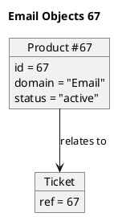

# 067 — Object: Email

```plantuml
@startuml
title Email Objects 67
object "Product #67" as O1 {
  id = 67
  domain = "Email"
  status = "active"
}
object "Ticket" as O2 {
  ref = 67
}
O1 --> O2 : relates to
@enduml
```
