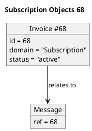

# 068 — Object: Subscription

```plantuml
@startuml
title Subscription Objects 68
object "Invoice #68" as O1 {
  id = 68
  domain = "Subscription"
  status = "active"
}
object "Message" as O2 {
  ref = 68
}
O1 --> O2 : relates to
@enduml
```
