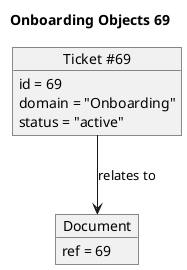

# 069 — Object: Onboarding

```plantuml
@startuml
title Onboarding Objects 69
object "Ticket #69" as O1 {
  id = 69
  domain = "Onboarding"
  status = "active"
}
object "Document" as O2 {
  ref = 69
}
O1 --> O2 : relates to
@enduml
```
