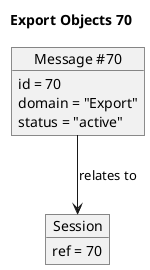

# 070 — Object: Export

```plantuml
@startuml
title Export Objects 70
object "Message #70" as O1 {
  id = 70
  domain = "Export"
  status = "active"
}
object "Session" as O2 {
  ref = 70
}
O1 --> O2 : relates to
@enduml
```
